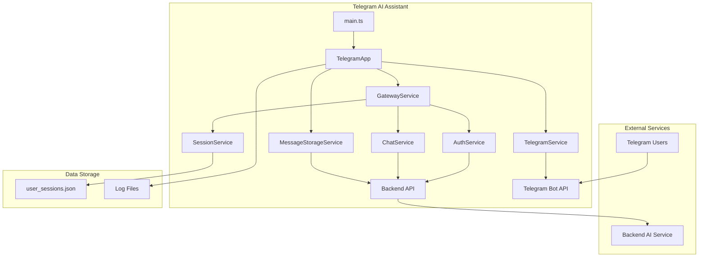
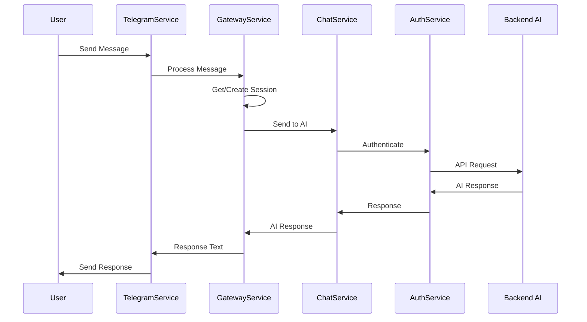
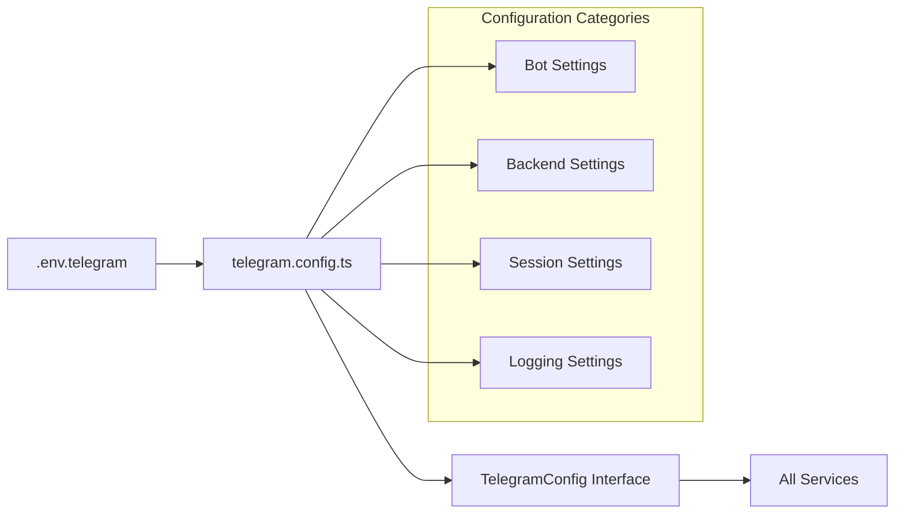
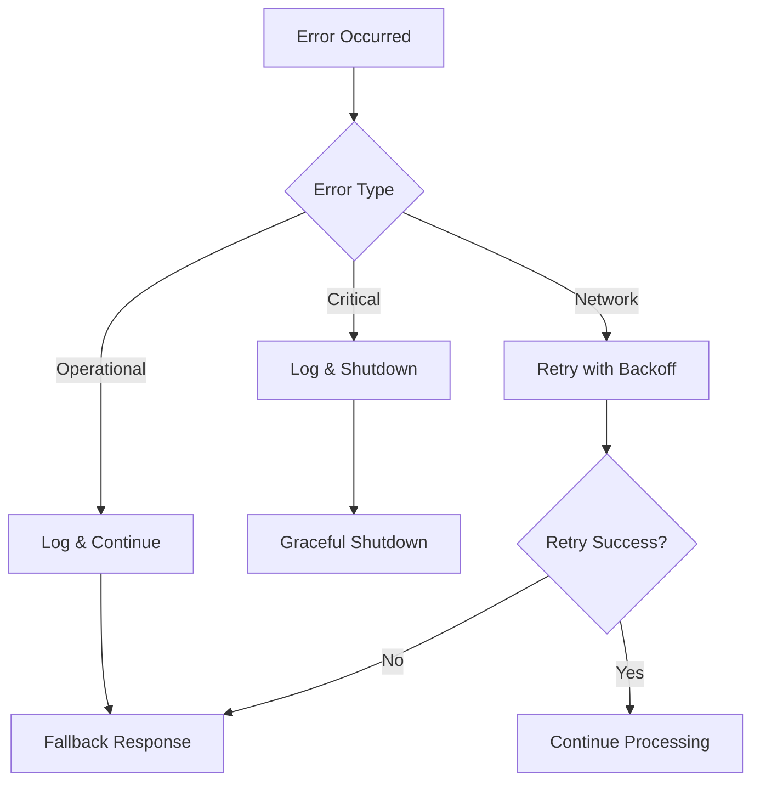
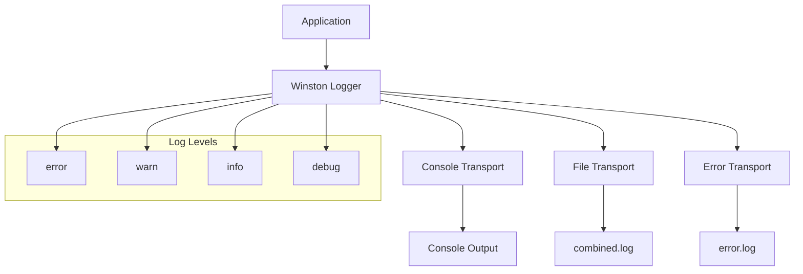
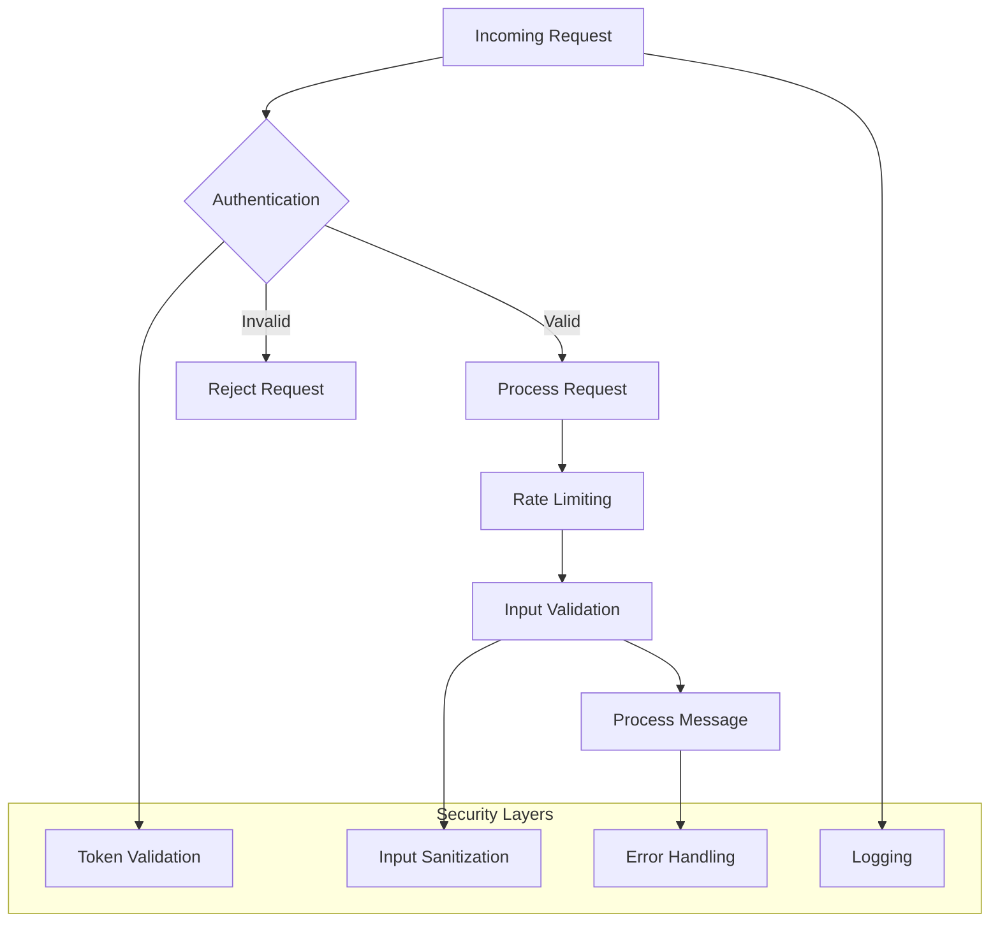
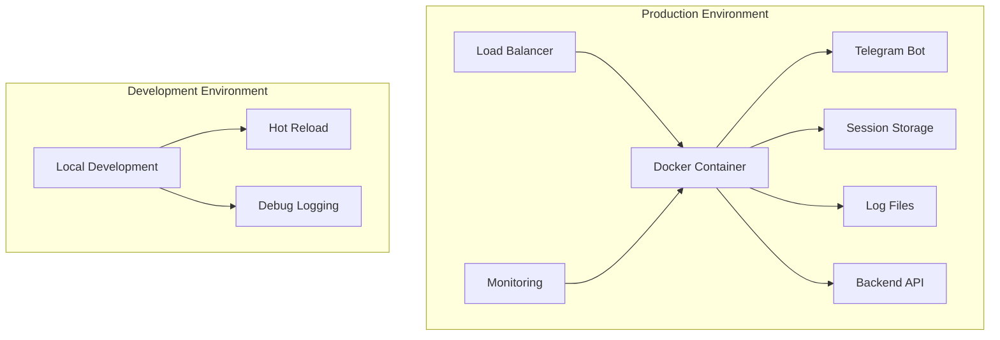

# Architecture Overview

## System Architecture

## Component Relationships

### Core Components

1. **TelegramApp** - Main application orchestrator
   - Manages application lifecycle
   - Coordinates between services
   - Handles command processing

2. **TelegramService** - Telegram bot interface
   - Manages bot interactions
   - Handles message sending/receiving
   - Provides typing simulation

3. **GatewayService** - Backend communication layer
   - Manages AI service integration
   - Handles session management
   - Coordinates message flow

4. **MessageStorageService** - Message processing
   - Processes Telegram messages
   - Extracts media information
   - Handles message conversion

### Supporting Services

5. **AuthService** - Authentication management
   - Handles service account auth
   - Manages JWT tokens
   - Provides authenticated requests

6. **ChatService** - Chat session management
   - Creates/manages chat sessions
   - Sends messages to AI
   - Retrieves chat history

7. **SessionService** - User session storage
   - Manages user sessions
   - Handles session persistence
   - Provides session cleanup

## Data Flow

## Configuration Architecture

## Error Handling Architecture

## Logging Architecture

## Security Architecture

## Deployment Architecture

## Key Design Patterns

### 1. Service Layer Pattern
- Each service has a single responsibility
- Services communicate through well-defined interfaces
- Easy to test and maintain

### 2. Dependency Injection
- Services are injected where needed
- Loose coupling between components
- Easy to mock for testing

### 3. Base Service Pattern
- Common functionality in base classes
- Consistent error handling
- Standardized logging

### 4. Configuration Pattern
- Centralized configuration management
- Environment-specific settings
- Type-safe configuration

### 5. Error Handling Pattern
- Custom error types
- Operational vs programming errors
- Graceful degradation

## Performance Considerations

### 1. Memory Management
- Session cleanup for old sessions
- Efficient data structures
- Proper resource disposal

### 2. Network Optimization
- Connection pooling
- Request batching
- Timeout handling

### 3. Caching
- Session caching
- Token caching
- Response caching

### 4. Monitoring
- Health checks
- Performance metrics
- Error tracking

## Scalability Considerations

### 1. Horizontal Scaling
- Stateless services
- Shared session storage
- Load balancing

### 2. Vertical Scaling
- Resource monitoring
- Performance profiling
- Capacity planning

### 3. Data Management
- Session persistence
- Log rotation
- Backup strategies
